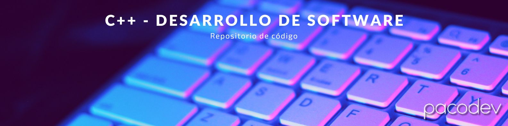

# Desarrollo de Software - C++



## Autor
Paco Chinchay (pacoDev)

## Descripción del Lenguaje C++
C++ es un lenguaje de programación de propósito general, de alto nivel y multiparadigma. Fue creado como una extensión del lenguaje de programación C, con añadidos de programación orientada a objetos, facilitando así la abstracción de datos y la reutilización de código. Es un lenguaje potente y versátil, utilizado en una amplia gama de aplicaciones, desde sistemas operativos hasta aplicaciones de escritorio y juegos.

# Características Principales:
- Orientación a Objetos: C++ soporta programación orientada a objetos, permitiendo la creación de clases, herencia, polimorfismo, encapsulamiento, y otras características fundamentales de la POO.

- Eficiencia: C++ es conocido por su eficiencia y velocidad de ejecución. Permite un control cercano del hardware y la gestión de memoria, lo que lo hace adecuado para aplicaciones donde el rendimiento es crítico.

- Flexibilidad: Es un lenguaje flexible que permite tanto programación procedural como orientada a objetos. También admite características de programación genérica a través de plantillas.

- Portabilidad: C++ es un lenguaje portátil, lo que significa que el código escrito en C++ puede ejecutarse en diferentes plataformas con pocos o ningún cambio, siempre que se respeten las normas del estándar del lenguaje.

# Usos Comunes:
- Desarrollo de Software de Sistema: C++ se utiliza ampliamente en el desarrollo de sistemas operativos, compiladores, controladores de dispositivos y otros software de bajo nivel.

- Aplicaciones de Escritorio: Es muy utilizado en el desarrollo de aplicaciones de escritorio, como editores de texto, suites de diseño gráfico, software de modelado 3D, entre otros.

- Desarrollo de Juegos: C++ es uno de los lenguajes más populares en la industria del desarrollo de videojuegos debido a su eficiencia y capacidad para acceder al hardware de bajo nivel.

- Software Empotrado: Se utiliza en el desarrollo de software para dispositivos embebidos y sistemas embebidos, como sistemas de control industrial, dispositivos médicos, y sistemas de automatización.

- Finanzas y Ciencias: Es ampliamente utilizado en aplicaciones financieras y científicas donde se requiere un alto rendimiento y cálculos complejos.

- Aplicaciones de Alto Rendimiento: C++ es la elección para aplicaciones que requieren un alto rendimiento, como servidores web, sistemas de gestión de bases de datos, y software de procesamiento de imágenes y señales.

En resumen, C++ es un lenguaje de programación versátil y potente que se utiliza en una amplia variedad de campos debido a su eficiencia, velocidad y flexibilidad.

## Requisitos

- Dev-C++ instalado en tu sistema.

## Uso

1. Clona este repositorio en tu máquina local:

Puedes clonar este repositorio en tu máquina local utilizando el siguiente comando de git:

```bash
git clone https://github.com/pacoDev/clases-desarrollo-software-senati.git
```

2. Abre el archivo `.cpp` en Dev-C++.

3. Compila el código.

4. Ejecuta el archivo `nombre_del_ejecutable.exe`.

## Contribución

Las contribuciones son bienvenidas. Si quieres mejorar algo o tienes alguna idea, por favor abre un *issue* o envía una *pull request*.
