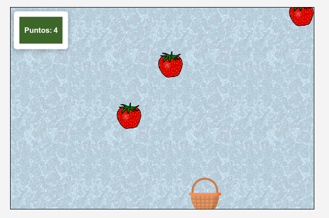

# Juego Recoge la Fruta - greenfoot



## Autor
Paco Chinchay (pacoDev)

## Descripción
Este proyecto es un juego desarrollado en Greenfoot para el curso de JAVA FUNDAMENTALS (ORACLE). El juego consiste en fresas que caen de manera aleatoria desde la parte superior de la pantalla, y una canasta que se mueve de izquierda a derecha para recoger estos objetos. El juego también incluye un contador de puntuación que se incrementa cada vez que la canasta recoge un objeto.

## Requisitos

Para trabajar en este proyecto, necesitarás lo siguiente:
- **Greenfoot**: Es un entorno interactivo de desarrollo Java diseñado principalmente para fines educativos. Puedes descargarlo desde su página oficial.
- **JDK (Java Development Kit)**: Es un kit de desarrollo para Java necesario para ejecutar Greenfoot. Puedes descargarlo desde la página oficial de Oracle.
- 
## Cómo Usar Este Repositorio

1. **Clonar el Repositorio**: Puedes clonar el repositorio a tu máquina local utilizando el comando

```bash
git clone https://github.com/pacoDev/clases-desarrollo-software-senati.git
```
2. **Realizar los cambios**: Realiza los cambios necesarios en el código de tu proyecto local.

3. **Consideraciones**: 
   - las imágenes pueden ser cambiadas por las que deseés, solo ten en cuenta que la canasta es de 64px x 64px y el marcador mide 128px x 128px.
   - puedes variar la velocidad de generación de frutas, la velocidad de la canasta y todo lo demás. **El código en este repositorio es de libre uso**
   - Dieviértete, al juego le puedes agregar que borre la fruta que no alcanzaste a recoger o añadir más variedad de frutas con sus respectivos Power Up's.