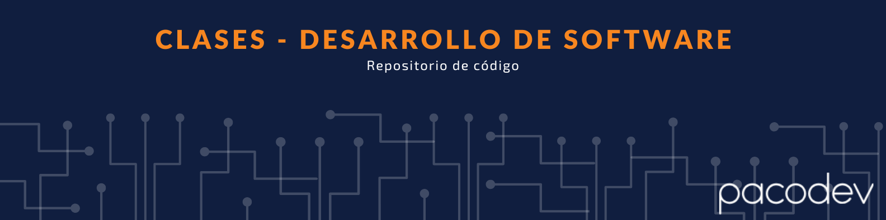

# Desarrollo de Software - SENATI



## Autor
Paco Chinchay (pacoDev)

## Descripción
Este repositorio contiene todas las clases y el código que voy desarrollado durante mi carrera de Desarrollo de Software en SENATI. El objetivo principal de este proyecto es compartir mi aprendizaje y experiencia con otros estudiantes y profesionales interesados en el campo del desarrollo de software.

## Estructura del Repositorio
El repositorio está organizado por semestres y cada semestre tiene carpetas separadas para cada curso. Dentro de cada carpeta de curso, encontrarás el código fuente, notas de clase y otros recursos relacionados con ese curso.

## Cómo Usar Este Repositorio
Puedes clonar este repositorio en tu máquina local utilizando el siguiente comando de git:

```bash
git clone https://github.com/pacoDev/clases-desarrollo-software-senati.git
```
Luego, puedes navegar a través de las carpetas para explorar el código y los recursos de cada curso.
